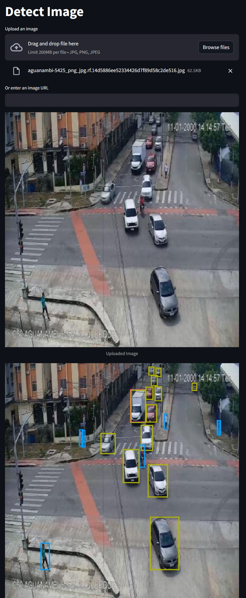

# Yolo Onnx

## Overview

This is project about detection using Yolov8.onnx

## Table of Contents
- [Yolo Onnx](#yolo-onnx)
  - [Overview](#overview)
  - [Table of Contents](#table-of-contents)
  - [Demo](#demo)
  - [Features](#features)
  - [Requirements](#requirements)
  - [Installation](#installation)
    - [Github](#github)
    - [Docker](#docker)
  - [Train on custom data](#train-on-custom-data)

## Demo
It can detect object from image or link of image
>> [Datasets](https://www.kaggle.com/datasets/yusufberksardoan/traffic-detection-project)



## Features
- Detects and identifies objects in images or links.
- Supports real-time object detection.
- Easily configurable and extensible for various use cases.

## Requirements
Specify the software and hardware requirements needed to run the project. For example:
- Pytorch
- Python 3.x
- GPU with CUDA support (optional but recommended for faster inference)

## Installation
Provide detailed installation instructions. If possible, create a virtual environment for your project. Here's a general installation process:
### Github
1. Clone the repository:
   ```bash
   git clone https://github.com/dinhanit/YoloOnnx.git

2. Set up 
    ```bash
    pip install -r requirements.txt

3. Demo with streamlit
    ```bash
    cd YoloOnnx/Web/
    streamlit run st.pt
### Docker
Quickly Start (linux)
1. Accept .sh
   ```bash
      chmod +x install.sh
2. Run install
   ```bash
      ./install.sh
3. Test
   ```bash
    http://localhost:8501/docs

Traditional docker:

1. Clone the docker:
   ```bash
      docker pull dinhanit/fastapi_detect:latest

2. Run
    ```bash
    docker run -d -p 8501:8501 dinhanit/fastapi_detect:latest

3. Test on fastapi
    ```bash
        http://localhost:8501/docs

## Train on custom data
1. Model properties

    
2. Set up
    ```bash    
    ├───Web
    │   └───weight
    └───Yolo
        └───datasets
            ├───test
            │   ├───images
            │   └───labels
            ├───train
            │   ├───images
            │   └───labels
            └───valid
                ├───images
                └───labels

3. Train
    ```bash
    cd Yolo
    python train.py

4. Convert to onnx model
    ```bash
    python convert_onnx.py
